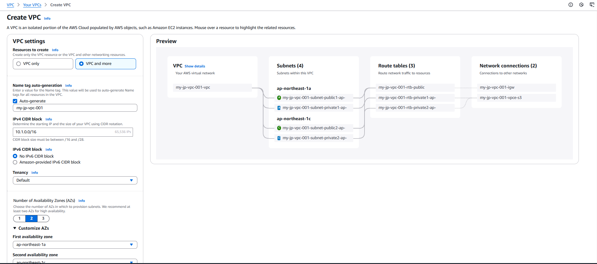

# AWS-Developer-Associate-Certificate
```
Day 1
Accounts
- Domain common:https://aws.amazon.com/
- Domain region: https://us-east-1.console.aws.amazon.com/
- hominhsang.bkhn@gmail.com / Shm@22....
- 2MA - Google authenticator

How to create EC2
https://000005.awsstudygroup.com/vi/3-create-ec2/
```

```
Day 2
Create VPC
https://www.youtube.com/watch?v=xVFidZhXiuQ&list=PL4NoNM0L1m7062X3tf0xidWQsLbS920Ql

```




Day 3
ssh -i "C:\Users\HoMinhSang\.ssh\my-ec2-1.pem" ec2-user@ec2-54-199-77-121.ap-northeast-1.compute.amazonaws.com
